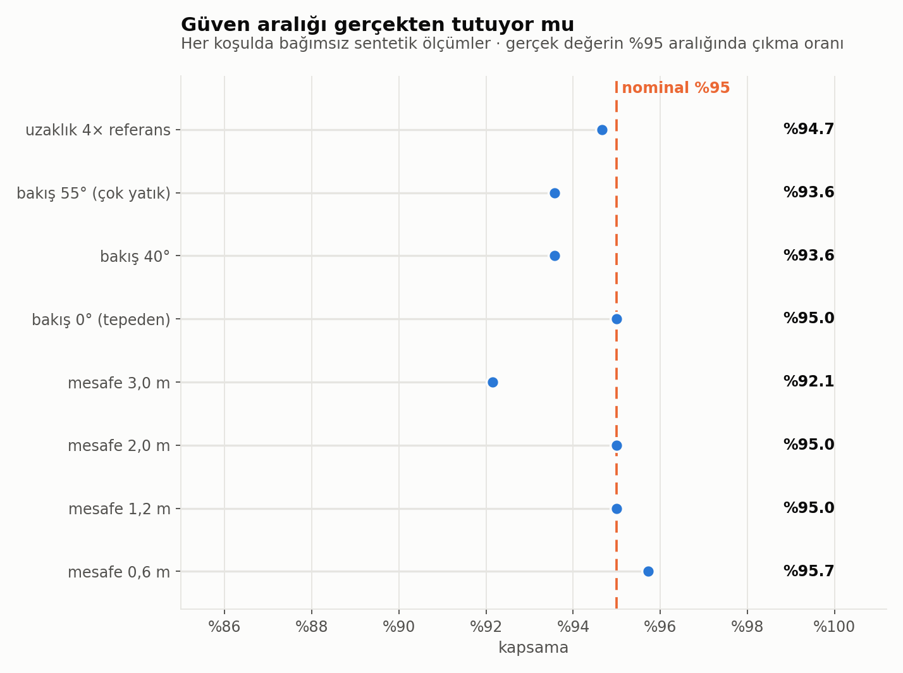
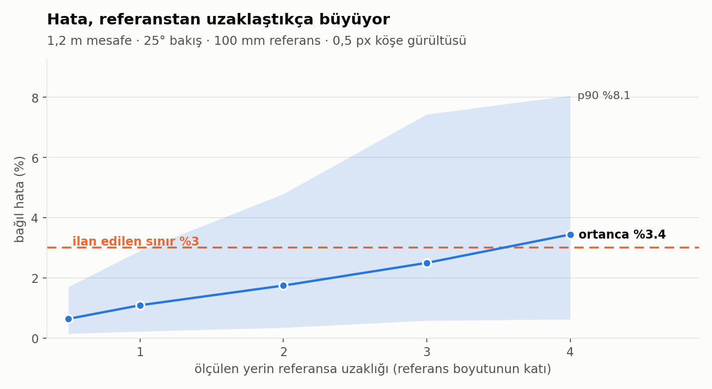
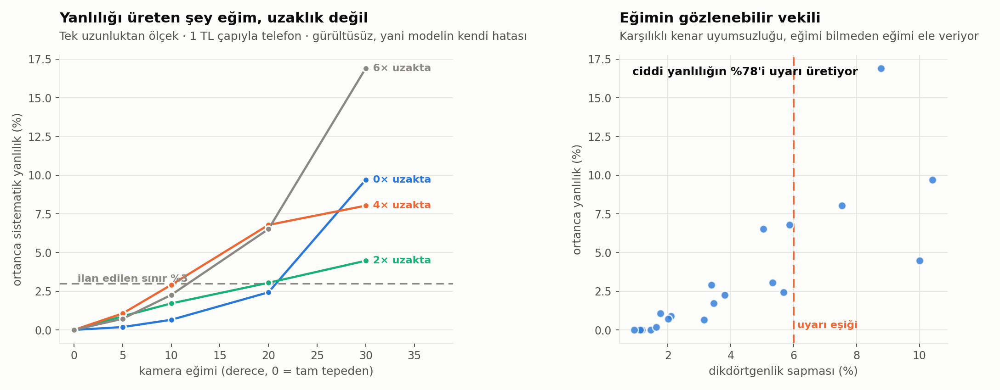
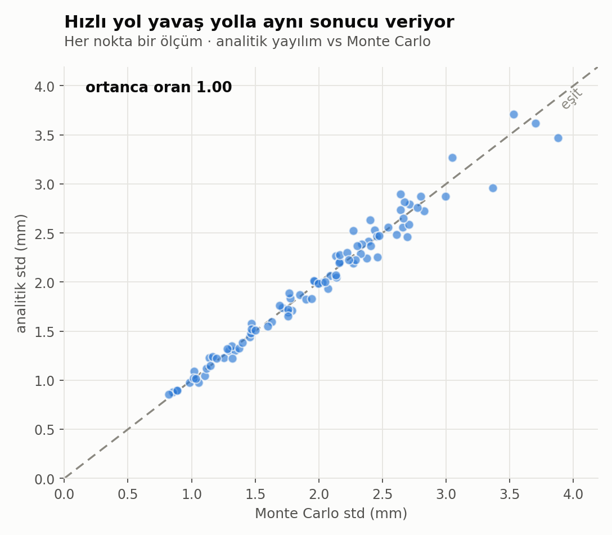

<div align="center">


**Real-world measurements from a single photo — with an honest error bar.**

```
Mesafe:   412.3 ± 8.7 mm (%95: 395.1–429.4)
```

`pure-NumPy core` · `hand-written Levenberg–Marquardt` · `56 tests` · `synthetic validation`

</div>

---

If a vision system says "41.2 cm", that alone is not information.
"41.2 ± 0.9 cm, 95% confidence" is. This package produces the second kind of
answer, and it shows — by measuring — that the interval it reports actually
holds.

```bash
pip install -e ".[web]"
metrik-goz panel          # http://127.0.0.1:8000 — no photo at hand? sample scenes are ready
```

<sub>

[Why](#why) · [What it does](#what-it-does) · [Usage](#usage) ·
[Web panel](#web-panel) · [HTTP API](#http-api) · [How it works](#how-it-works) ·
[Validation](#validation) · [Limits](#limits) · [Install](#install-and-tests)

</sub>

---

## Why

Every system that makes decisions from a camera goes through the same step:
getting from pixels to real units. You cannot work out which recipe saves how
much food without knowing how many grams the tomato in the fridge weighs; you
cannot decide whether a 48 cm robot fits through a gap in the rubble without
knowing how many centimeters wide that gap is.

In the second case the cost of an error is asymmetric: missing a passable route
wastes time, **mistaking an impassable one for passable strands the robot
inside.** A point estimate is not enough there — you have to decide on the lower
end of the interval. This package exists to produce that lower end reliably.

---

## What it does

When the scene contains one object of known size, it measures everything
**on the same plane** as that object, in millimeters:

| Measurement | What you get |
|---|---|
| `kutu` | width, height and area of an object whose four corners you mark |
| `mesafe` | distance between two points, mm |
| `uzunluk` | total length of a polyline, mm |
| `alan` | polygon area, mm² |
| `en_dar_gecit` | narrowest point of the free space + a "does this footprint fit" verdict |

Every measurement returns an `Olcum`: the value, its standard deviation, a
confidence interval, and which method produced it.

The reference can come from one of two families, and the difference decides how
much of the measurement you can trust:

| Reference family | What you supply | What you get |
|---|---|---|
| **similarity** (`Homografi.olcekten`) | a single known **length** — a coin's diameter, a card's long edge — and its two endpoints | scale. Perspective is **not** corrected: correct if the photo was taken from directly above, systematically wrong if it was taken at an angle |
| **projective** (`Homografi.kur`) | four points — an ArUco marker or the corners of a rectangular object | scale **and** perspective correction |

The cheap route is not always valid; where each one fails is measured in the
[Validation](#validation) section.

Reference table shipped in the box (`metrik_goz.referans`):

| Family | Ready-made options |
|---|---|
| Single length | 1 TL · 50/25/10/5/1 kuruş · €2 · €1 · 50 cents · US quarter · long or short edge of a credit card |
| Rectangle | `kredi_karti` (ISO ID-1) · `a4` · `a5` · `cd` · `post_it` |
| ArUco | `DICT_4X4_50` (you give the edge length), corners at sub-pixel accuracy |

---

## Usage

```python
from metrik_goz import Homografi, olcum, belirsizlik, referans
import cv2

goruntu = cv2.imread("masa.jpg")
dunya, resim, kimlik = referans.aruco_bul(goruntu, kenar_mm=100.0)

h = Homografi.kur(dunya, resim)
noktalar = [(412, 690), (905, 712)]          # the two points you want to measure

sonuc = belirsizlik.monte_carlo(
    dunya, resim,
    lambda hh, nn: olcum.mesafe(hh, nn[0], nn[1]),
    noktalar, sigma_px=0.4,
)
print(sonuc)          # 412.3 ± 8.7 mm (%95: 395.1–429.4)
```

No ArUco marker? The diameter of a coin you drop next to the object is enough —
in that case the reference model builds the homography itself:

```python
kur = lambda uc: Homografi.olcekten(uc[0], uc[1], 26.15)   # 1 TL diameter

sonuc = belirsizlik.monte_carlo(
    None, para_uclari_px,
    lambda hh, nn: olcum.kutu(hh, nn).en_mm,
    telefon_koseleri_px, sigma_px=1.5, kur_fn=kur,
)
```

From the command line:

```bash
metrik-goz kutu   masa.jpg  --olcek-ad 1_tl --uc 812,455 --uc 888,455 \
                            --kose-nesne ... (the object's 4 corners)
metrik-goz mesafe masa.jpg  --aruco 100 --nokta 412,690 --nokta 905,712
metrik-goz alan   masa.jpg  --nesne a4 --kose ... (the reference's 4 corners) \
                            --nokta ... (at least 3 polygon points)
metrik-goz gecit  enkaz.jpg --aruco 200 --maske serbest.png --ayak-izi 480
metrik-goz ornek  --sahne hepsi --cikti ornekler/
metrik-goz dogrula --cikti dogrulama/
metrik-goz panel  --port 8000
```

Every command takes the reference through the same flags: `--aruco EDGE_MM`,
`--olcek-ad NAME --uc x,y ×2`, `--olcek LENGTH_MM --uc x,y ×2`, or
`--nesne NAME --kose x,y ×4`. The shared `--mc` sets the Monte Carlo sample
count.

The gap command decides on the **lower end** of the interval, because of the
asymmetry above.

---

## Web panel

```bash
pip install -e ".[web]"
metrik-goz panel            # http://127.0.0.1:8000
```

Drag an image into the browser, mark the reference, measure. The flow and the
sample scenes sit on the left, the canvas in the middle, the steps and warnings
on the right; the four cards along the top always show the real output of the
last measurement.

| Card | What it shows |
|---|---|
| **ÖLÇÜ** | the value itself (width / height / area) |
| **HATA PAYI** | standard deviation |
| **GÜVEN ARALIĞI** | lower–upper bound; the end of this interval is what you decide on |
| **AKTİF REFERANS** | which reference, which model, σ and the reprojection RMS |

The flow has three steps:

| Step | In the panel |
|---|---|
| **1 · Photo** | drag and drop, paste with `⌘V`, or pick a file |
| **2 · Reference** | **Length**: pick a coin/card from the list (or type the mm yourself), click its two ends · **Rectangle**: credit card / A4 / A5 / CD / post-it or your own dimensions, click its four corners · **ArUco**: type the edge length, let it be detected |
| **3 · Object** | draw a four-cornered box over the thing you want to measure |
| **Result** | width, height and area; each with its confidence interval, plus warnings with the most dangerous one first |

Three things are yours under **Gelişmiş**: click noise (`sigma_px`, typically
1–2 px when marking by hand), confidence level (68% / 90% / 95% / 99%) and the
Monte Carlo sample count. All three feed straight into the computation — they
are not decoration.

The panel drives a single flow — "how many centimeters is this object". The
`mesafe`, `uzunluk`, `alan` and `en_dar_gecit` measurements live in the library,
the CLI and the `/api/olc` endpoint; they are not in the panel, because a
single-flow interface beats one where a misplaced click gives you the wrong
measurement.

You can drag points to correct them, zoom with the wheel, and get back with
`sığdır`; the magnifier next to the cursor is for seating a corner pixel by
pixel. Click noise is a real term in the uncertainty (`sigma_px`), so the
magnifier is not decoration either.

**The panel measures nothing.** Every number you see comes from the same
tested functions in `metrik_goz.olcum` and `metrik_goz.belirsizlik`; the browser
only collects pixel coordinates. Writing the same computation twice in two
places means that one day the two will drift apart —
`testler/test_web.py` checks that the number the panel returns is identical to
the one the library returns.

One detail: the uploaded image is decoded once on the server and re-encoded
**without EXIF**, and that copy is what goes to the browser. Phone photos carry
a rotation flag; the browser applies it, and if the server does not, the (x, y)
you click and the (x, y) that gets measured are different places, and the
measurement comes out silently wrong.

### If you don't have a photo

The **Örnek sahneler** buttons in the sidebar open synthetic scenes with a known
answer: since we placed the camera, the reference and the distance to be
measured, the panel can print the true value next to the measurement — and mark
it **✓** if the true value falls inside the interval, **✗** if it does not.
There is no other way to see at a glance whether a confidence interval holds; a
real photo has no ground truth. Opening a scene also places the reference
endpoints and the object corners, so what you see is already a finished
measurement; move the points around and watch what changes.

The same scenes can be written to disk (image + a JSON carrying the true value):

```bash
metrik-goz ornek --sahne hepsi --cikti ornekler/
```

| Sample | What's in it | True answer | In the panel |
|---|---|---|---|
| `duz` | phone on a table, 1 TL next to it; shot almost straight down | 146.7 × 71.5 mm · 104.9 cm² | ✓ |
| `egik` | same scene, shot at 26° | same | ✓ |
| `gecit` | 200 mm ArUco, a free corridor narrowing in the middle | 520.0 mm | CLI/API |

`duz` and `egik` share the same true answer and differ only in camera angle —
running them back to back shows in one glance where a scale built from a single
length holds and where it does not. In the `egik` scene the system measures
112 mm instead of 146.7 mm **and says so with a high-level warning**; it does
not fail silently.

---

## HTTP API

The panel talks to its own server only through these endpoints; the same ones
are usable from outside (`metrik-goz panel`, default `127.0.0.1:8000`).

| Endpoint | What it does |
|---|---|
| `POST /api/gorsel` | uploads an image (multipart `dosya`), produces an EXIF-free copy, returns `gorsel_id` |
| `POST /api/ornek` | `{"ad": "duz"}` — generates a synthetic scene; returns the true answer and hint points too |
| `POST /api/aruco` | looks for ArUco in the image, returns the corners and a typical `sigma_px` |
| `POST /api/olc` | the measurement itself: reference + points → value, std, confidence interval, warning list |
| `GET /api/durum` | version, OpenCV version, upload limit |
| `GET /gorsel/<kimlik>` | the server's normalized copy of the uploaded image |

Warnings come back from `/api/olc` with a `seviye` (`yuksek` / `orta` / `bilgi`)
and the most dangerous one is listed first; the thresholds differ per model,
because the similarity and projective models are weak in different places.

---

## How it works

Three steps, and each one has a trap of its own.

**1 · Building the homography.** The four corners of the reference fix the
projective transform between the world plane and the image. First a closed-form
starting solution from DLT with Hartley normalization, then a refinement with a
hand-written Levenberg–Marquardt.

When you don't have four points — you know only the diameter of the coin from
your pocket — no projective transform can be built: two points and a length
carry three numbers, while a projective transform has eight degrees of freedom.
Rather than inventing the missing information, a narrower model is built
(`Homografi.olcekten`): scale + rotation + translation, meaning perspective is
**not** corrected. This is not a cheap shortcut; it is a declared and measured
limit — where it holds is below.

Why DLT alone is not enough: DLT minimizes the *algebraic* error, while what we
want to shrink is the *geometric* reprojection error. Under noise the two do not
give the same solution.

The LM solver lives in this repo too (`lm.py`), because every uncertainty claim
the package makes rests on the covariance the solver produces — we have no right
to say "±3 cm" on top of a covariance whose origin we don't know. The analytic
Jacobian was derived by hand and is checked against a numerical derivative
(`testler/test_lm.py`).

**2 · Measurement.** Since a projective transform maps lines to lines, carrying
the polygon corners onto the world plane and measuring there is enough. The one
exception is `en_dar_gecit`: the boundary of the free space can be curved, so
the scan runs on the world plane along cross-sections perpendicular to the axis
of travel. In each cross-section the **longest** uninterrupted free run is
taken — in a corridor split in two by an obstacle, the total width would be
misleading.

**3 · Uncertainty.** The error comes from two separate places, and any system
that does not count both produces intervals that are falsely narrow:

- pixel noise on the reference corners → the homography is built wrong
- pixel noise on the points you measure → the right homography, the wrong spot

Both methods count both. **Monte Carlo** samples both noises and rebuilds the
homography each time; it makes no distributional assumptions and is the
reference. The **analytic** route propagates to first order; it is fast and it
is checked against Monte Carlo.

---

## Validation

A real photo has no ground truth — if it did, there would be nothing to measure.
So validation runs on synthetic scenes: we place the camera, the reference and
the distance to be measured, and hand the system nothing but noisy pixels.

Every number below is produced by `metrik-goz dogrula`; not one number in this
README was typed by hand.

### Does the confidence interval actually hold

That is the real question. If the system says "95%", then across many
independent measurements the true value should land inside that interval 95% of
the time.



The average over eight conditions is **94.3%**. The one-point shortfall from the
nominal 95% is real and explainable: parametric bootstrap centers the
distribution not on the true corners but on the *observed* — already noisy —
corners. The width of the interval is right, its center drifts a little. We
write that down instead of hiding it — better than saying 95% and delivering 80%.

The notable part: **coverage holds even under conditions where accuracy breaks
down.** Measuring at 4× the reference distance pushes the median error to 3.4%,
but the interval still covers 94.7% — the system knows it is degrading and says
so, rather than failing silently. Coverage drops the most at 3 meters (92.1%);
there the reference is small in pixels, which strains the first-order
assumptions the hardest.

### How far does the error stay under 3%



| Condition | Coverage | Median error | p90 error |
|---|---|---|---|
| 0.6 m distance | 95.7% | 0.59% | 1.27% |
| 1.2 m distance | 95.0% | 1.31% | 2.76% |
| 2.0 m distance | 95.0% | 1.83% | 4.57% |
| 3.0 m distance | 92.1% | 2.82% | 7.24% |
| Top-down view (0°) | 95.0% | 1.00% | 2.53% |
| 40° view | 93.6% | 1.08% | 2.63% |
| 55° view (very oblique) | 93.6% | 1.15% | 3.79% |
| 4× the reference size away | 94.7% | 3.41% | 10.51% |

**Declared operating envelope:** 100 mm reference, 0.5 px corner noise, up to
3 meters distance, up to 2× the reference size away from it. Inside that
envelope the median relative error stays under 3%.

That the viewing angle barely affects the error is surprising at first; the
reason is that the homography already models perspective exactly. What decides
the outcome is not the angle but the **pixel size of the reference in the image**
and how far the measured spot is from it.

### Where a scale from a single length holds, and where it doesn't

Everything above is for the four-point projective reference. Most of the time
the user doesn't have one, they have a coin — and that model is weak somewhere
else entirely.



| Condition | Systematic bias | Coverage |
|---|---|---|
| Straight down, reference anywhere | 0.000% | 95.1% |
| 30° tilted shot | 16.9% | 27.1% |

Three things to read off this:

**Tilt produces the bias, not distance.** Shooting straight down, the scale is
the same everywhere on the plane, so the bias is zero wherever the coin sits —
"distance from the reference", the risk in the projective model, is harmless
here on its own. As the view tilts the bias grows, and distance multiplies it.

**This bias is NOT INSIDE the error bar.** Monte Carlo counts click noise; it
cannot count the model's own defect — which is why coverage collapses from 95.1%
to 27.1% as tilt grows. The width of the interval is right, its center moves.
This is exactly the place where a system can fail silently, so we put it front
and center.

**The user doesn't know the tilt, but the system can see it.** In a tilted shot
the opposite edges of the measured object diverge; `Kutu.dikdortgenlik` measures
that divergence and stands in as an observable proxy for tilt. A 6% threshold
catches **78%** of biases larger than 5%, at the cost of 16% false alarms. The
"this photo was shot at an angle, the error bar does not cover it" warning in
the panel and the CLI rests on that number — the warning text is not a guess, it
is a measured catch rate. The panel uses the same quantity a second time at a 2%
threshold as a "medium" level: to mention slight perspective before it spoils
the decision.

### Does the fast route agree with the slow one



The standard deviation from analytic propagation is a median **1.00** times the
Monte Carlo one. So inside this operating envelope the first-order approximation
is valid, and the 400× faster route can be used with confidence.

---

## Limits

These belong in the middle of the README rather than at the end, because these
are the places where the system fails silently:

- **The plane assumption.** Everything you measure has to be on the same plane
  as the reference. You can measure the tomato on the table with the card you
  put on the table; you cannot measure the box on the shelf.
  `Homografi.duzlem_disi_uyarisi` reports how far you have strayed from the
  reference; above 2, don't trust the measurement.
- **Perspective under a single-length scale.** A similarity model built from a
  coin's diameter does not correct perspective, and the bias it leaves is not
  inside the error bar — 16.9% bias and 27.1% coverage in a 30° tilted shot. The
  system catches and warns about this through `Kutu.dikdortgenlik` (78% of the
  serious biases), but 22% goes uncaught: shoot the photo from directly above
  the object, or use something rectangular as the reference and mark its four
  corners.
- **Lens distortion.** Wide-angle phone cameras need undistortion first for the
  edge regions. The package does not do that yet; camera intrinsics support is
  the next step.
- **Corner noise estimates.** The `sigma_px` defaults are empirical (ArUco 0.4;
  clicking by hand 1.5). Measuring them on your own setup gives a better answer.
- **Mask quality in gap measurement.** `en_dar_gecit` assumes the free-space
  mask it is given is correct. The mask's own error is not modeled in this
  package — that is the segmentation layer's job.

---

## Install and tests

```bash
pip install -e ".[gelistirme]"
pytest testler/ -q          # 56 tests, ~15 s
metrik-goz dogrula          # produces the plots and sonuclar.json (~1 min)
metrik-goz panel            # open the web panel
```

The core math depends on NumPy alone — even the critical values for the
confidence interval come from the standard library, no scipy needed. OpenCV is
only for ArUco detection and image reading, Flask only for the panel; if you
supply your own corners the core runs without either. Python 3.10+.

| Extra | What it brings |
|---|---|
| `.[goruntu]` | OpenCV — ArUco detection, image reading |
| `.[web]` | Flask + OpenCV — `metrik-goz panel` |
| `.[grafik]` | matplotlib — `metrik-goz dogrula` plots |
| `.[gelistirme]` | all of it + pytest |

### Repo layout

```
metrik_goz/
  homografi.py     homography via DLT + LM, similarity model, off-plane warning
  lm.py            hand-written Levenberg–Marquardt (analytic Jacobian)
  olcum.py         mesafe, uzunluk, alan, kutu, en_dar_gecit
  belirsizlik.py   Monte Carlo and analytic propagation, the Olcum type
  referans.py      ArUco detection, known length/object tables
  sentetik.py      scene generator with a known answer
  ornek.py         the panel's and the CLI's sample scenes
  dogrulama.py     coverage/error/similarity sweeps and their plots
  cli.py           command line
  web/             Flask server + panel (server computes, browser only pixels)
testler/           56 tests: geometry, LM, coverage, web-library equality
dogrulama/         output of `metrik-goz dogrula`: plots + sonuclar.json
ornekler/          output of `metrik-goz ornek`: image + true-answer JSON
metrik-goz-atolye/ a step-by-step workshop for writing the same core from
                   scratch (deliberately half-done: tests ready, code is yours)
```

---

## What this repo is part of

`metrik-goz` is the first link in a series that runs the same vision core in two
different worlds: on one side rescuing food on its way to spoiling in the fridge,
on the other finding a passable route through rubble. Both solve the same
problem — look at a disordered pile, pull the real size of the individual objects
out of it, and decide under a constraint. The only thing that changes is what the
constraint is.

This package is the "real size" link of that chain.
